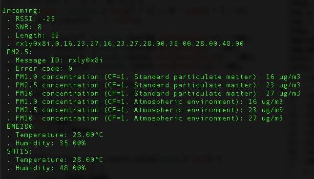

# Decode WisNode

## Introduction

A companion project to [Uno_RAK811](https://github.com/Kongduino/Inkplate_Raw_Bitmap), which sends LoRa packets containing environment data. So, since we're sending stuff, we also need to receive it, right? ;-)

In this example, we'll use a computer connected to a WisNode LoRa via USB, and some Python code.

## Requirements

1. A WisNode LoRa (duh)
2. Python3 (although I bet it'd work in 2.7, but let's not tempt the devil...)
3. The `pyserial`, `time`, `sys` and `binascii` modules.

## Workflow

The Python code opens a serial port based on `sys.argv[1]`, and waits for a reset of the WisNode, to make sure you're both in sync. It then reads a line when it comes in, and splits the fields. If it doesn't start with `at+recv` it drops it. If it does, it shows first the message info (RSSI, SNR, length), and then, based on what was originally an error code (0 being no error), and is now a series code (0: HM3301, BME280, SHT15; 1: Multichannel Gas Sensor), decodes the data and pretty-prints it out.

